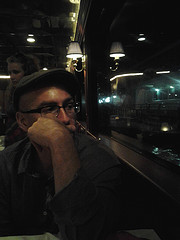

Dan DaCosta
{: style="text-align: center"}
chaosape@chaosape.com
{: style="text-align: center"}

* TOC
{:toc style="text-align: center"}

* * *

# *Education*
{: style="text-align: center"}

* * *

## University of Minnesota (Ph. D.)

| **Degree**  | Doctor of Philosophy in Computer Science (in progress) |
| **Advisor** | Dr. Gopalan Nadathur |
| **Thesis**  | Reasoning about Linear Logic Specifications (working title) |
| **Time Frame**  | 2011 --- 2018 (fin ~2019)|

## Drexel University (M.S.C.S.)

| **Degree**  | Master of Science in Computer Science |
| **Advisor** | Dr. Spiros Mancoridis |
| **Thesis**  | pcapstich: A Tool to Collect Singleton One-way Delay and Loss Measurements |
| **Time Frame**  | 2002 --- 2011 |

## Drexel University (B.S.C.S.)

| **Degree**  | Bachelor of Science in Computer Science |
| **Time Frame**  | 1998 --- 2002 |

* * *

# *Professional*
{: style="text-align: center"}

* * *

## Rockwell Collins

| **Title**  | Ph.D. Intern |
| **Time Frame**  | 2013 --- present |

*Secured Mathematically-Assured Composition of Control Modules[SMACCM]
(2015-Present)*
{: style="text-align: center"}

> The SMACCM project developed provably secure tools for building UAV
software. One of the platforms the SMACCM project targeted relied on
the [seL4](https://sel4.systems) microkernel. On this platform, UAV
software with different functional behavior was implemented as
separate seL4 components. This provided each component a formally
proved memory isolation invariant. Building a complete UAV system on
this platform required a specification for how components were
organized and communicated. The [Trusted Build]() tool, something I
helped develop, could translate this specifications to seL4's less
intuitive [CAmkES](http://wiki.sel4.systems/CAmkES) build
specification. Inter-Component communication could, however, allow one
component to cause deadlock in one another. I solved this problem by
modifying the Trusted Build tool to inject "monitors", i.e., seL4
components for communication queue management, between two components
susceptible to such deadlock. Correct behavior of these monitors was
formally proved using
[AutoCorress](http://ssrg.nicta.com.au/projects/TS/autocorres/).

> The SMACCM project has ended and I am now working toward transfering
the formal methods methodologies developed during the SMACCM project
to other domains. Supervisory Control and Data Acquisition[SCADA]
systems is one domain I am currently investigating for such
transfer. This work can positively impact the safety of SCADA systems
used to control critical infrastructure, e.g., electrical power grid
systems, nuclear power station control systems, naval vessel control
systems.

*Air Force Research Lab's (AFRL) Summer of Innovation (2017-2018)*
{: style="text-align: center"}

> Modeled after the "Google Summer of Code" program, the goal was to
bring current formal methods theory and practice to bear on AFRL's
Unmanned Systems Autonomy Services software(UxAS). One critical
component of UxAS provides waypoint sequences to proprietary autopilot
software as the unmanned vehicle proceeds through a mission. I was
responsible for porting this component to the
[seL4](https://sel4.systems) microkernel. Furthermore, I verified a
number of important properties about this component using
[AutoCorress](http://ssrg.nicta.com.au/projects/TS/autocorres/); an
extension to the
[Isabelle Theorem Prover](https://isabelle.in.tum.de/) that permits
formal reasoning about C programs. This work contributed to a
simulation where an unmanned vehicle remained on mission despite
loosing signficant software functionality due to cyber attack. The
results of our work were
[presented](http://mys5.org/Proceedings/2017/Day_3/2017-S5-Day3_1345_SoI_Task-Service_Planning_Group_Backes.pdf)
at [S5](http://mys5.org).  Our success during the Summer of Innovation
influenced AFRL to fund our project past the original period of
performance.

*Automated System Requirement Verification (2013-2015)*
{: style="text-align: center"}

> Primary developer of [SpeAR](https://github.com/AFifarek/SpeAR), a
tool for system requirement specification and verification. SpeAR
accepts formalized requirements and translated these requirements to a
synchronous dataflow language. Another tool,
[jkind](https://github.com/agacek/jkind), translated this synchronous
dataflow language to specifications suitable for SMT solvers.  Through
this series of translation, some properties of the specified system
requirements could be verified in an automated fashion. SpeAR is
written in [Java](https://www.java.com/) using the
[Eclipse IDE](https://eclipse.org/) with the
[xtext](https://www.itemis.com/en/xtext/download/) plugin.

## Lockheed Martin

| **Title**  | Senior Member of the Engineering Staff |
| **Time Frame**  | 2003 --- 2011 |

*Malware Provenance (2010 --- 2011)*
{: style="text-align: center"}

> Applied statistical modeling techniques to data retrieved via analysis
of binary malware in an attempt to recover authorship information.

*Transparent Protocol Layer Altering Network Device (2005 --- 2010)*
{: style="text-align: center"}

> Worked with team members in the Advanced Technology Laboratory to
design and implement a network device that could alter standard
protocol behaviors to better suit network characteristics. The
modifications to protocol behavior were implemented such that clients
required no modification or non-standard configuration. The system
allowed for easy modification of protocol behavior through
configuration files and served as an experimental platform for new
protocol modifications. The device was tested during a number of live
aerial exercises. Later revisions of this project relied extensively
on the
[Click Modular Router](http://www.read.cs.ucla.edu/click/click).

*Buffer Overflow Mitigation (2003 --- 2004)*
{: style="text-align: center"}

> Developed an experimental technique and framework that allowed buffer
overflows to be detected and mitigated in c code at runtime. The
prototype framework for this technique used the [C Intermediate
Language](http://www.cs.berkeley.edu/~necula/cil/) to transform
programs into ones that would dynamically increase buffer size upon
detection of overruns. Buffer overruns were detected using
[electric fence]([http://en.wikipedia.org/wiki/Electric_Fence).

* * *

# *Teaching*
{: style="text-align: center"}

* * *

## University of Minnesota

| **Title**  | Teaching Assistant |
| **Time Frame**  | 2011 --- 2015 |

*Advanced Programming Principles (x3)*
{: style="text-align: center"}

> Students were introduced to techniques for creating correct, robust, modular
> programs including: computing with symbolic data, recursion/induction,
> functional programming, impact of evaluation strategies,
> organizing data/computations around types, search-based programming,
> informal reasoning about programs.

*Program Design and Development (x3)*
{: style="text-align: center"}

> A project based course intended to expose students to:
> principles of programming design/analysis, concepts in software
> development, large development using C/C++, data structures,
> debugging, files, I/O, state machines, testing, and coding standards.

*Programming Languages (x2)*
{: style="text-align: center"}

> This course had two primary goals: (1) to expose students to language
> design principles, concepts, constructs; (2) to make students more familiar
> with language paradigms and their applications.

* * *

# *Publications*
{: style="text-align: center"}

* * *

+ Dan DaCosta. [Towards Reasoning About Properties of Imperative
Programs using Linear Logic](pubs/1503.00826v1.pdf).
Report submitted in partial fulfillment of my written preliminaries.

+ Dan DaCosta. [pcapstitch: A tool to collect singleton one-way delay and loss measurements](pubs/pcapstitch.pdf).
Master thesis submitted in partial fulfillment of my Ms. of Computer
Science from Drexel University.

+ Dan DaCosta, Christopher Dahn, Spiros Mancoridis and Vassilis Prevalakis.
[Characterizing the Security Vulnerability Likelihood of Software Functions](pubs/ICSM03.pdf).
In the IEEE Proceedings of the 2003 International Conference on
Software Maintenance (ICSM'03), Amsterdam, The Netherlands,
September, 2003.

* * *

# *Presentations*
{: style="text-align: center"}

* * *

+ Dan DaCosta and Gopalan Nadathur. *Towards Reasoning about
Properties of Imperative Programs using Linear Logic*. Midwest
Verification Days 2014, Columbia, MO, October 3-4, 2014.

+ Jesse Brown and Daniel DaCosta. *Synthesizing Adaptive Protocols by
Selective Enumeration (SYNAPSE)*. Symposium on Click Modular Router,
Belgium, November 23-24, 2009.

+ Dan DaCosta and Todd Hughes. *Adaptive Code Injection Attack
Mitigation*. Sante Fe Institute Business Network Topical Meeting -
Adaptive and Resilient Computing Security (ARCS), November 3rd and
4th 2004, Sante Fe, New Mexico.

* * *

# *Technical Skills*
{: style="text-align: center"}

* * *

| **Programming Languages** | OCaml, Python, C, Java, Prolog, C++ |
| **Verification Tools** | Isabelle, AutoCorres, Abella, jkind, Coq |
| **General Development Tools** | Emacs, GDB, Valgrind, Eclipse, Vim, Xtext, SQLite  |
